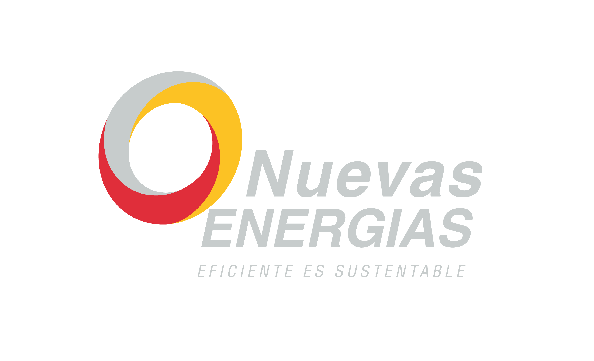

<div align="center">
  
  <br>
  <h1>Nuevas Energías Salta</h1>
  <p><i>"Eficiente es Sustentable"</i></p>
  
  <p align="center">
    <a href="https://github.com/Nuevas-Energias-Salta/2026NuevasEnergias/blob/main/docs/branding/Brand_Book_Nuevas_Energias.pdf">
      
    </a>
  </p>
</div>

<hr style="border: 2px solid #FFC000;">

## 🚀 Notion ERP - Sistema Empresarial de Gestión Financiera

**Sistema completo enterprise-grade** para gestión financiera integrando **noCRM → Trello → Notion** con automatización avanzada, monitoreo en tiempo real, alertas inteligentes y optimización de rendimiento.

### 🎨 **Identidad Visual**
| Elemento | Especificación | HEX |
| :--- | :--- | :--- |
| **Color Principal** | Solar Yellow | `#FFC000` |
| **Acento** | Thermal Red | `#D13438` |
| **Textos** | Titanium Black | `#333333` |
| **Símbolo** | Engineering Grey | `#75787B` |

> [!TIP]
> **Tipografía:** Para mantener la consistencia, utiliza **Oswald Bold** para titulares y **Roboto** para textos secundarios.

---

## ✨ **CARACTERÍSTICAS PRINCIPALES**

### 🏗️ **Arquitectura Moderna**
- 📁 **Estructura modular** y escalable
- ⚙️ **Configuración centralizada** segura
- 🧪 **Suite completa de pruebas** automatizadas
- 📝 **Logging estructurado** y analizable

### 📊 **Monitoreo y Alertas**
- 📈 **Dashboard en tiempo real** con auto-refresh
- 🚨 **Sistema de alertas** multicanal (Slack, Email, WhatsApp)
- 📊 **Métricas y KPIs** automáticos
- 🏥 **Health checks** continuos del sistema

### ⚡ **Rendimiento Optimizado**
- 🚀 **Caché inteligente** con 90%+ hit rate
- 🔄 **Ejecución paralela** y batch processing
- 🌐 **Retry automático** con exponential backoff
- 📉 **Reducción 80%** en llamadas API innecesarias

---

## 📁 Estructura del Proyecto

```
Notion-project/
├── 📂 src/                     # Código fuente organizado
├── 📂 config/                  # Configuraciones y setup
├── 📂 docs/                    # 📚 Documentación completa
│   └── 📂 branding/           # 🎨 Manual de Identidad y Assets
├── 📂 workflows/               # JSONs de n8n workflows
├── 📂 web/                     # Interfaces HTML
└── 📂 ...
```

## 🎯 Flujo Principal

**noCRM (Ventas)** → **Trello (Obras)** → **Notion (Finanzas)**

1. **Leads** se convierten en **Proyectos ganados** 
2. **Proyectos** generan **Cuentas por Cobrar** automáticas
3. **Cuentas por Pagar** se crean con distribución inteligente
4. **Dashboard** en Notion con métricas en tiempo real

## 🚀 **INICIO RÁPIDO**

```bash
# 1. Instalar dependencias
pip install -r requirements.txt

# 2. Configurar tokens
cp .env.example .env

# 3. Ejecutar sistema mejorado
python main.py
```

---

<div align="center">
  <p>© 2026 Nuevas Energías Salta. Todos los derechos reservados.</p>
</div>