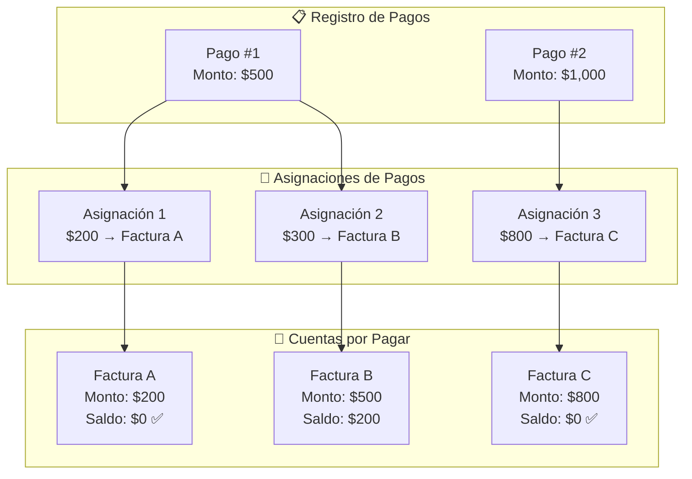
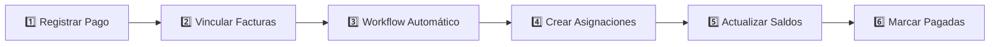

# Sistema de Asignación de Pagos - CxP

## Diagrama de Relaciones

---

## Flujo del Proceso

---

## Bases de Datos Involucradas

| Base de Datos | Función |
|---------------|---------|
| **Registro de Pagos** | Donde se registra cada pago realizado |
| **Asignaciones de Pagos** | Detalle de cuánto de cada pago va a cada factura |
| **Cuentas por Pagar** | Las facturas/deudas pendientes |

---

## Campos Clave

### Registro de Pagos
- Monto (total del pago)
- Cuenta Por Pagar (facturas vinculadas)
- Total Asignado (rollup - suma de asignaciones)
- Saldo a Favor (Monto - Total Asignado)

### Asignaciones de Pagos
- Monto Asignado (porción del pago para esta factura)
- Pago (relación al pago origen)
- CxP (relación a la factura destino)

### Cuentas por Pagar
- Monto base (valor de la factura)
- Monto Asignado Total (rollup - suma de asignaciones)
- Saldo Pendiente (Monto base - Monto Asignado Total)

---

## Ejemplo Práctico

**Situación:** 
- Factura A: $200
- Factura B: $500  
- Factura C: $800

**Se realiza un pago de $700 vinculando las 3 facturas:**

| Factura | Monto | Asignado | Saldo | Estado |
|---------|-------|----------|-------|--------|
| A | $200 | $200 | $0 | Pagado ✅ |
| B | $500 | $500 | $0 | Pagado ✅ |
| C | $800 | $0 | $800 | Pendiente |

El sistema asigna automáticamente en orden de fecha (FIFO).
